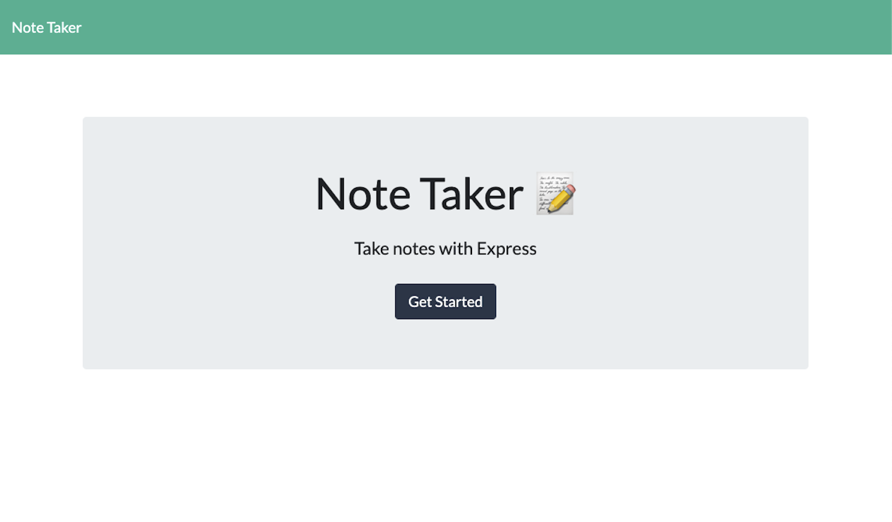
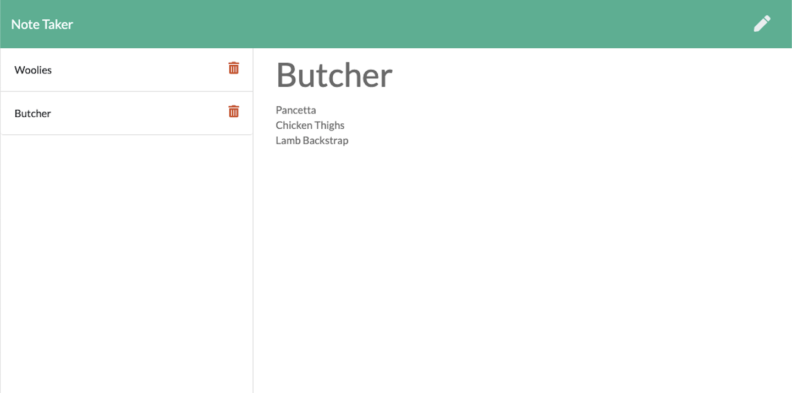

# Note-Taker

## Deployment
The Note Taker has been deployed on Heroku [(https://desolate-reef-25794.herokuapp.com/](https://desolate-reef-25794.herokuapp.com/)

## Technologies
- Node.js, using Express & FS packages

## Description
This application is used to take notes, which are then saved to a simple JSON database.

## What We Did
The Front-End application was provided, and we made this work by developing the Back-End of the application to make it work utilising Express and Node.js by implementing GET, POST & DELETE routes and functions.

## Screenshot

